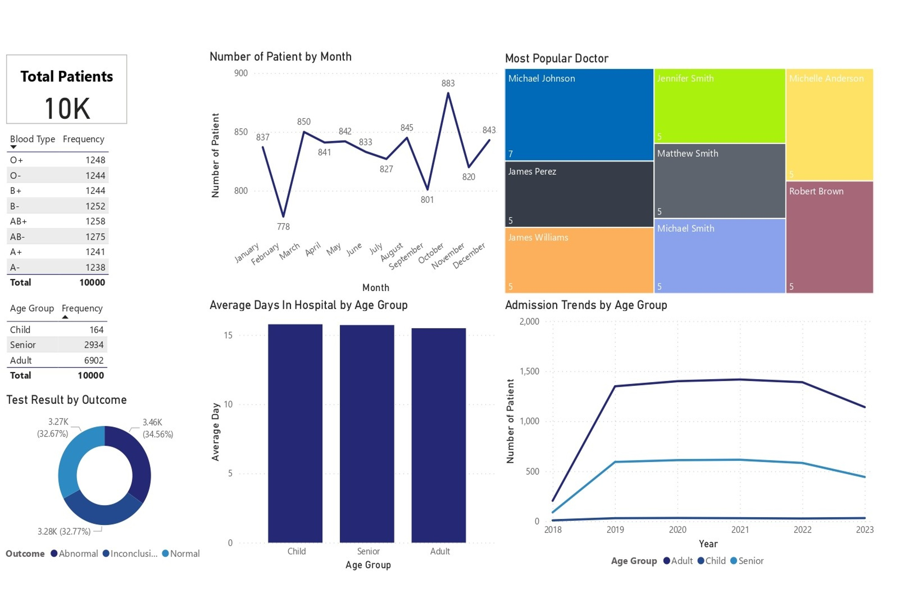

# Healthcare-Data-Analysis-using-PowerBi

## Overview
This project analyzes healthcare patient data to uncover insights into
demographics, medical conditions, hospital utilization, and insurance billing.
The analysis was conducted using Power BI with a structured CSV dataset
containing 10,000 patient records.

## Dataset
- **File**: healthcare_dataset.csv
- **Size**: 10,000 records
- **Features**: Patient demographics, medical conditions, hospitals,
  doctors, billing amount, insurance provider, length of stay
- **Quality**: No nulls or duplicates, derived columns added for analysis

## Dashboard
An interactive Power BI dashboard was built to visualize:
- Patient demographics (age group, gender, blood type)
- Medical condition prevalence
- Hospital and doctor-level trends
- Billing patterns by insurance provider
- Monthly admission trends

## Key Insights
- Asthma and Cancer are the most common medical conditions
- November shows peak hospital admissions
- Adult patients dominate the dataset
- Cigna has the highest average billing amount
- Certain hospitals and doctors show consistently high patient volume

## Project Structure

data/ → raw healthcare dataset
dashboards/ → Power BI (.pbix) dashboard
docs/ → presentation and written report
images/ → dashboard screenshots
notebooks/ → future Python analysis

## Tools Used
- Power BI
- Excel / CSV
- Git & GitHub

## How to Use
1. Download the dataset from `data/`
2. Open `dashboards/healthcare_analysis.pbix` in Power BI Desktop
3. Refresh data if required
4. Explore interactive dashboards

## Author
**Md Sahid Parvez**  
Aspiring Data Engineer | Data Analyst

